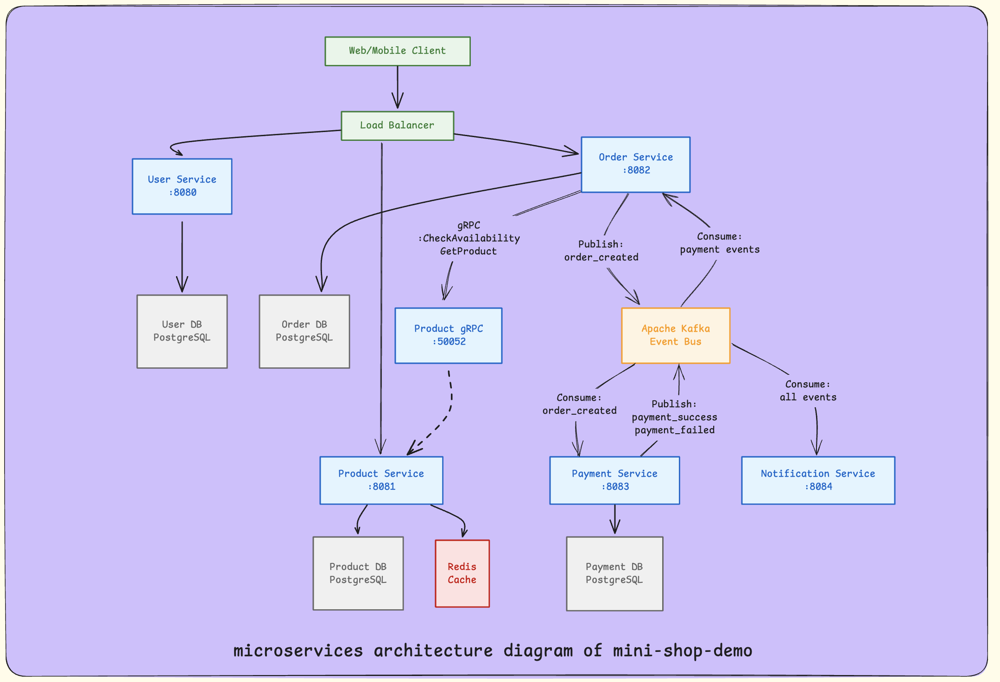

# CUET Microservices E-Commerce Platform

A production-ready, cloud-native microservices-based e-commerce system built with Go, demonstrating modern software engineering practices, distributed systems patterns, and comprehensive observability.

## 📋 Table of Contents

- [Overview](#overview)
- [Architecture](#architecture)
- [Technology Stack](#technology-stack)
- [Services](#services)
- [Prerequisites](#prerequisites)
- [Quick Start](#quick-start)
- [Configuration](#configuration)
- [API Documentation](#api-documentation)
- [Development Guide](#development-guide)
- [Testing](#testing)
- [CI/CD](#cicd)
- [Monitoring & Observability](#monitoring--observability)
- [Deployment](#deployment)
- [Project Structure](#project-structure)
- [Contributing](#contributing)
- [License](#license)

## 🎯 Overview

This project is a comprehensive microservices implementation showcasing:

- **5 Independent Microservices** with clear separation of concerns
- **Event-Driven Architecture** using Apache Kafka for asynchronous communication
- **Distributed Transaction Management** via Saga pattern
- **Full Observability Stack** with metrics, tracing, and logging
- **Resilience Patterns** including circuit breakers, retries, and caching
- **Multiple Communication Protocols** (REST, gRPC, Message Queue)
- **Containerized Deployment** with Docker and Docker Compose
- **CI/CD Pipeline** with automated testing, linting, and security scanning

## 🏗️ Architecture

### System Architecture Diagram



### Communication Patterns

1. **Synchronous Communication**
   - REST APIs for external clients
   - gRPC for inter-service communication (Order ↔ Product)

2. **Asynchronous Communication**
   - Kafka for event-driven messaging
   - Event types: `order_created`, `payment_success`, `payment_failed`

3. **Data Storage**
   - PostgreSQL (one database per service)
   - Redis (caching layer for Product Service)

### Design Patterns

- **Saga Pattern**: Distributed transaction orchestration for order processing
- **Circuit Breaker**: Fault tolerance for external service calls
- **CQRS**: Separate read/write models where applicable
- **Event Sourcing**: Event-driven state management
- **API Gateway Pattern**: Service-specific endpoints

## 🛠️ Technology Stack

### Core Technologies
- **Language**: Go 1.23+
- **Web Framework**: Gin
- **Database**: PostgreSQL 15
- **Cache**: Redis 7
- **Message Broker**: Apache Kafka 7.4.0
- **Service Discovery**: Docker DNS

### Observability
- **Metrics**: Prometheus
- **Visualization**: Grafana
- **Tracing**: Jaeger (OpenTelemetry)
- **Logging**: Loki + Promtail

### Development & DevOps
- **Containerization**: Docker
- **Orchestration**: Docker Compose
- **CI/CD**: GitHub Actions
- **Linting**: golangci-lint
- **Security Scanning**: Trivy
- **Testing**: Go testing framework with sqlmock

## 🚀 Services

### 1. User Service (Port 8080)
**Responsibilities**: User management and authentication

- User registration and login
- JWT-based authentication
- Password hashing with bcrypt
- User profile management

**Database**: `userdb` (PostgreSQL)

**Key Features**:
- RESTful API
- JWT token generation and validation
- Secure password storage

### 2. Product Service (Port 8081, gRPC 50052)
**Responsibilities**: Product catalog management

- Product CRUD operations
- Product availability checking
- Redis caching for performance
- Circuit breaker for resilience

**Database**: `productdb` (PostgreSQL)
**Cache**: Redis

**Key Features**:
- REST API for external access
- gRPC API for internal services
- Redis caching with TTL
- Circuit breaker pattern

### 3. Order Service (Port 8082, gRPC 50051)
**Responsibilities**: Order processing and orchestration

- Order creation and management
- Product availability validation (via gRPC)
- Saga pattern implementation
- Event publishing to Kafka

**Database**: `orderdb` (PostgreSQL)

**Key Features**:
- REST and gRPC APIs
- Saga pattern for distributed transactions
- Kafka event producer
- Kafka event consumer (for saga compensation)

### 4. Payment Service (Port 8083)
**Responsibilities**: Payment processing

- Payment processing simulation
- Event-driven architecture
- Payment status management

**Database**: `paymentdb` (PostgreSQL)

**Key Features**:
- Kafka consumer (listens to `order_created`)
- Kafka producer (publishes `payment_success`/`payment_failed`)
- Payment simulation with configurable success rate

### 5. Notification Service (Port 8084)
**Responsibilities**: Event-driven notifications

- Consumes all system events
- Sends notifications (email simulation)
- Retry logic for failed notifications

**Key Features**:
- Kafka consumer for all event types
- Retry mechanism with exponential backoff
- Notification metrics tracking

## 📦 Prerequisites

### Required Software
- **Docker** 20.10+ and **Docker Compose** 2.0+
- **Go** 1.23+ (for local development)
- **Protocol Buffers Compiler** (protoc) - for gRPC services
- **Git** (for cloning the repository)

### Optional Tools
- **kubectl** (for Kubernetes deployment)
- **Postman** or **curl** (for API testing)
- **Make** (for running service-specific commands)

## 🚀 Quick Start

### 1. Clone the Repository
```bash
git clone https://github.com/sagoresarker/mini-shop-demo.git
cd mini-shop-demo
```

### 2. Start All Services
   ```bash
   docker-compose up -d
   ```

### 3. Verify Services are Running
   ```bash
   docker-compose ps
   ```

All services should show as "healthy" or "running".

### 4. Access Services

| Service | URL | Credentials |
|---------|-----|-------------|
| User Service | http://localhost:8080 | - |
| Product Service | http://localhost:8081 | - |
| Order Service | http://localhost:8082 | - |
| Payment Service | http://localhost:8083 | - |
| Notification Service | http://localhost:8084 | - |
| Prometheus | http://localhost:9090 | - |
| Grafana | http://localhost:3000 | admin/admin |
| Jaeger UI | http://localhost:16686 | - |
| Kafdrop | http://localhost:9000 | - |

### 5. Run System Tests
```bash
./test-system.sh
```

## ⚙️ Configuration

### Environment Variables

Each service can be configured via environment variables. Default values are set in `docker-compose.yml`.

#### Common Variables
- `DB_HOST`: Database hostname
- `DB_PORT`: Database port (default: 5432)
- `DB_USER`: Database user (default: postgres)
- `DB_PASSWORD`: Database password (default: postgres)
- `DB_NAME`: Database name (service-specific)
- `JAEGER_ENDPOINT`: Jaeger collector endpoint

#### Service-Specific Variables

**Kafka Services** (Order, Payment, Notification):
- `KAFKA_BROKER`: Kafka broker address (default: kafka:9092)
- `KAFKA_TOPIC`: Kafka topic name (default: order_events)

**Product Service**:
- `REDIS_HOST`: Redis hostname (default: redis)
- `REDIS_PORT`: Redis port (default: 6379)

**Order Service**:
- `PRODUCT_SERVICE_GRPC`: Product service gRPC endpoint (default: product-service:50052)

### Configuration Files

- `docker-compose.yml`: Service orchestration and networking
- `prometheus.yml`: Prometheus metrics collection configuration
- `loki-config.yml`: Loki logging configuration
- `promtail-config.yml`: Promtail log shipping configuration
- `.golangci.yml`: Go linting configuration

## 📚 API Documentation

### User Service API

#### Register User
```http
POST /register
Content-Type: application/json

{
  "name": "John Doe",
  "email": "john@example.com",
  "password": "password123"
}
```

#### Login
```http
POST /login
Content-Type: application/json

{
  "email": "john@example.com",
  "password": "password123"
}
```

**Response**:
```json
{
  "token": "eyJhbGciOiJIUzI1NiIs...",
  "user": {
    "id": 1,
    "name": "John Doe",
    "email": "john@example.com"
  }
}
```

#### Get Profile (Requires JWT)
```http
GET /profile
Authorization: Bearer <token>
```

### Product Service API

#### List Products
```http
GET /products
```

#### Get Product
```http
GET /products/:id
```

#### Create Product
```http
POST /products
Content-Type: application/json

{
  "name": "Laptop",
  "price": 999.99,
  "stock": 50
}
```

#### Update Product
```http
PUT /products/:id
Content-Type: application/json

{
  "name": "Updated Laptop",
  "price": 899.99,
  "stock": 45
}
```

#### Delete Product
```http
DELETE /products/:id
```

### Order Service API

#### Create Order
```http
POST /orders
Content-Type: application/json

{
  "user_id": 1,
  "product_id": 1,
  "quantity": 2
}
```

#### Get Order
```http
GET /orders/:id
```

### Health Check Endpoints

All services expose a health check endpoint:
```http
GET /health
```

**Response**:
```json
{
  "status": "healthy",
  "service": "service-name"
}
```

### Metrics Endpoints

All services expose Prometheus metrics:
```http
GET /metrics
```

## 💻 Development Guide

### Local Development Setup

#### 1. Install Dependencies
   ```bash
# For each service
cd user-service  # or product-service, order-service, etc.
go mod download
   ```

#### 2. Setup gRPC Services (Product & Order)

Install protoc plugins:
   ```bash
   go install google.golang.org/protobuf/cmd/protoc-gen-go@latest
   go install google.golang.org/grpc/cmd/protoc-gen-go-grpc@latest
```

Generate protobuf files:

**Product Service**:
```bash
cd product-service
   protoc --go_out=. --go_opt=paths=source_relative \
          --go-grpc_out=. --go-grpc_opt=paths=source_relative \
       proto/product.proto
```

**Order Service**:
```bash
cd order-service
make proto  # or run protoc commands manually
```

#### 3. Run Services Locally

**Prerequisites**: Ensure Docker services (PostgreSQL, Redis, Kafka) are running:
```bash
docker-compose up -d postgres-user postgres-product redis kafka
```

**Run a service**:
   ```bash
cd user-service
   go run main.go
   ```

### Project Structure

```
mini-shop-demo/
├── .github/
│   └── workflows/
│       └── ci.yml              # CI/CD pipeline
├── user-service/
│   ├── handlers/              # HTTP handlers
│   ├── middleware/            # Auth, logging, metrics, tracing
│   ├── models/                 # Data models
│   ├── database/              # DB initialization
│   ├── Dockerfile
│   └── go.mod
├── product-service/
│   ├── handlers/              # REST + gRPC handlers
│   ├── cache/                 # Redis caching
│   ├── circuitbreaker/        # Circuit breaker implementation
│   ├── proto/                 # gRPC definitions
│   └── ...
├── order-service/
│   ├── handlers/              # REST + gRPC handlers
│   ├── kafka/                 # Producer & consumer
│   ├── grpc/                  # gRPC client
│   ├── circuitbreaker/
│   └── ...
├── payment-service/
│   └── ...
├── notification-service/
│   └── ...
├── docker-compose.yml         # Service orchestration
├── prometheus.yml             # Metrics config
├── loki-config.yml            # Logging config
└── README.md
```

### Code Style

- Follow Go standard formatting (`gofmt`)
- Use `golangci-lint` for linting (configured in `.golangci.yml`)
- Follow Go naming conventions
- Write unit tests for handlers and business logic

### Building Services

**Using Docker**:
```bash
docker-compose build <service-name>
```

**Locally**:
```bash
cd <service-name>
go build -o <service-name> ./main.go
```

## 🧪 Testing

### Running Tests

**Run all tests for a service**:
```bash
cd user-service
go test ./... -v
```

**Run tests with coverage**:
```bash
go test ./... -coverprofile=coverage.out
go tool cover -html=coverage.out
```

**Run tests with race detection**:
```bash
go test ./... -race
```

### Test Structure

- Unit tests for handlers (using `go-sqlmock` for database mocking)
- Integration tests for service interactions
- Health check endpoint tests

### Test Files

- `*_test.go` files in each service
- Mock implementations for external dependencies
- Test utilities and helpers

### Automated Testing

The CI pipeline automatically runs:
- Unit tests for all services
- Linting checks
- Security scanning (Trivy)

## 🔄 CI/CD

### GitHub Actions Workflow

The project includes a comprehensive CI/CD pipeline (`.github/workflows/ci.yml`):

1. **Linting**: Runs `golangci-lint` on all services (non-blocking)
2. **Unit Tests**: Runs tests for all services in parallel
3. **Docker Build**: Builds Docker images for all services
4. **Security Scanning**: Scans images with Trivy
5. **Image Push**: Pushes images to Docker Hub (on main/develop branches)

### Pipeline Jobs

- **Lint**: Code quality checks (non-blocking)
- **Test**: Unit tests with coverage
- **Build & Push**: Docker image building and publishing
- **Summary**: Build status summary

### Manual Triggers

The pipeline runs on:
- Push to `main` or `develop` branches
- Pull requests to `main` or `develop` branches

## 📊 Monitoring & Observability

### Metrics (Prometheus)

All services expose Prometheus metrics at `/metrics`:
- HTTP request counts and durations
- Service-specific metrics (e.g., notifications sent, payments processed)
- Database connection metrics

**Access**: http://localhost:9090

### Tracing (Jaeger)

Distributed tracing is implemented using OpenTelemetry and Jaeger:
- Request tracing across services
- Span correlation
- Performance analysis

**Access**: http://localhost:16686

### Logging (Loki)

Centralized logging with Loki and Promtail:
- Structured logging with zap
- Log aggregation
- Log querying and visualization

**Access**: http://localhost:3100

### Visualization (Grafana)

Pre-configured dashboards for:
- Service metrics
- Request rates and latencies
- Error rates
- System health

**Access**: http://localhost:3000 (admin/admin)

## 🚢 Deployment

### Docker Compose Deployment

**Start all services**:
```bash
docker-compose up -d
```

**Stop all services**:
```bash
docker-compose down
```

**View logs**:
```bash
docker-compose logs -f <service-name>
```

**Restart a service**:
```bash
docker-compose restart <service-name>
```

### Production Considerations

1. **Security**:
   - Change default passwords
   - Use secrets management
   - Enable TLS/SSL
   - Implement rate limiting

2. **Scalability**:
   - Use Kubernetes for orchestration
   - Implement horizontal pod autoscaling
   - Use managed databases and message brokers

3. **High Availability**:
   - Deploy multiple instances
   - Use load balancers
   - Implement database replication
   - Use Kafka clusters

4. **Monitoring**:
   - Set up alerting rules
   - Configure log retention policies
   - Implement distributed tracing

### Environment-Specific Configurations

- **Development**: Use `docker-compose.yml` as-is
- **Staging**: Add environment-specific overrides
- **Production**: Use Kubernetes manifests or cloud-native services

